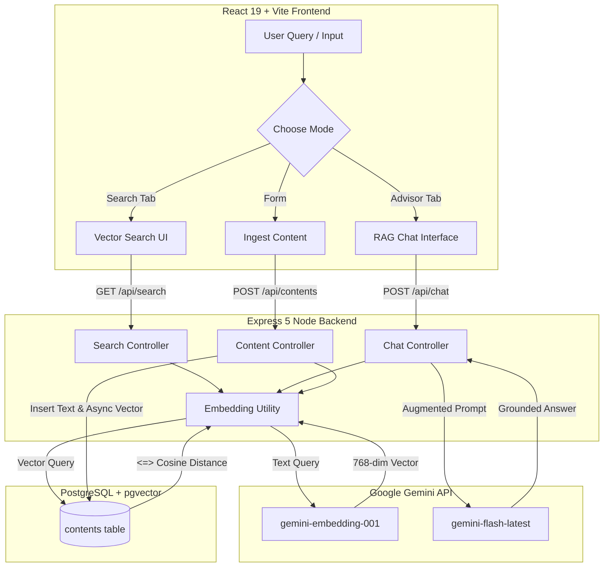

# 🧠 SemanticEngine: AI-Powered Content Retrieval & RAG System

Welcome to the comprehensive technical documentation for **SemanticEngine**, an enterprise-grade **Retrieval-Augmented Generation (RAG)** platform designed for vector similarity search and grounded conversational AI.

---

## 📌 Executive Summary

SemanticEngine transforms static organizational documentation into an interactive, searchable knowledge base. Rather than relying on simple keyword matching (lexical search), SemanticEngine converts human text into high-dimensional vector representations (**768-dimensional embeddings**). Using PostgreSQL with the `pgvector` extension, it calculates cosine distance (`<=>`) to match queries with the most semantically relevant documents and feeds them to Google Gemini AI to produce strictly grounded, hallucination-free answers with precise source citations.

---

## 🛠️ Technology Stack Breakdown

### 1. Frontend Infrastructure
- **Framework**: [React 19](https://react.dev/) + [Vite](https://vitejs.dev/)
- **Styling & Design Tokens**: [TailwindCSS v3](https://tailwindcss.com/)
- **Animation & Transitions**: [Framer Motion](https://www.framer.com/motion/) (Smooth page switching, micro-interactions, modal overlays)
- **Icons**: [Lucide React](https://lucide.dev/)
- **API Client**: Native `fetch` with environment-aware URL routing.

### 2. Backend Engine
- **Runtime**: [Node.js](https://nodejs.org/) (ES Modules)
- **Web Framework**: [Express 5](https://expressjs.com/)
- **Security & Rate Limiting**: `express-rate-limit` (100 requests / minute window), CORS policy configured for cross-origin deployment.
- **Environment Management**: `dotenv` / `dotenvx`

### 3. AI & Embeddings Layer
- **AI SDK**: `@google/generative-ai`
- **Embedding Model**: `gemini-embedding-001` (Configured for strict 768-dimensional vector outputs)
- **Chat / RAG Model**: `gemini-flash-latest` (Prompted to act as a grounded knowledge advisor)

### 4. Database & Vector Storage
- **Database**: [PostgreSQL 15](https://www.postgresql.org/)
- **Vector Extension**: [`pgvector`](https://github.com/pgvector/pgvector)
- **Similarity Operator**: Cosine Distance (`<=>`)
- **Data Types**: `UUID` primary keys, `VECTOR(768)` embedding columns.

### 5. DevOps & Containerization
- **Containerization**: [Docker](https://www.docker.com/) & Docker Compose (`pgvector/pgvector:pg15`)
- **Frontend Hosting**: Vercel
- **Backend Hosting**: Render

---

## 🏗️ System Architecture & Workflow



---

## 🔌 API Reference & Endpoints

### 1. Ingest Content
- **Endpoint**: `POST /api/contents`
- **Body**:
  ```json
  {
    "title": "Server Maintenance Policy",
    "content": "Scheduled maintenance occurs every Sunday at 03:00 UTC."
  }
  ```
- **Response**: `201 Created` with content object and background embedding trigger.

### 2. Semantic Vector Search
- **Endpoint**: `GET /api/search?q=when is system downtime&limit=5`
- **Response**:
  ```json
  {
    "status": "success",
    "count": 1,
    "results": [
      {
        "id": "03c5e88d-9279-4f63-aebb-aea3580f3257",
        "title": "Server Maintenance Policy",
        "content": "Scheduled maintenance occurs every Sunday at 03:00 UTC...",
        "distance": 0.1423
      }
    ]
  }
  ```

### 3. AI Advisor (RAG Chat)
- **Endpoint**: `POST /api/chat`
- **Body**:
  ```json
  {
    "message": "What time does server maintenance start?"
  }
  ```
- **Response**:
  ```json
  {
    "status": "success",
    "data": {
      "answer": "Scheduled maintenance occurs every Sunday at 03:00 UTC [Source ID: 03c5e88d-9279-4f63-aebb-aea3580f3257].",
      "citations": [
        {
          "id": "03c5e88d-9279-4f63-aebb-aea3580f3257",
          "title": "Server Maintenance Policy"
        }
      ]
    }
  }
  ```

---

## 🚀 Local Development Setup Guide

### Prerequisites
- Node.js v18+
- Docker Desktop

### 1. Clone & Setup Backend
```bash
cd backend
npm install
cp .env.example .env
```
Ensure your `.env` contains:
```env
PORT=4000
DB_HOST=127.0.0.1
DB_PORT=5433
DB_USER=admin
DB_PASSWORD=admin
DB_NAME=ai_content
GEMINI_API_KEY=your_gemini_api_key_here
```

### 2. Start PostgreSQL via Docker
```bash
docker compose -f docker/postgres.yml up -d
```

### 3. Seed Database
```bash
node seed.js
```

### 4. Run Backend & Frontend Servers
```bash
# Backend (Terminal 1)
cd backend && npm run dev

# Frontend (Terminal 2)
cd frontend && npm install && npm run dev
```

---

## 🔒 Key Design & Security Highlights

1. **Strict RAG Grounding**: The AI Advisor prompt strictly enforces that answers must be derived *only* from retrieved document context, preventing AI hallucinations.
2. **Citation Transparency**: Automatically parses and extracts `[Source ID: ...]` references so users can inspect source materials.
3. **Async Non-Blocking Architecture**: Document creation responds immediately while embedding generation runs in an asynchronous background worker fiber.
4. **Optimized Vector Dimensions**: Configured to exact 768-dimensional outputs, maintaining maximum legibility, zero truncation errors, and high retrieval accuracy.
